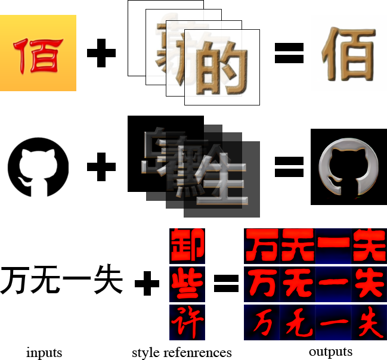
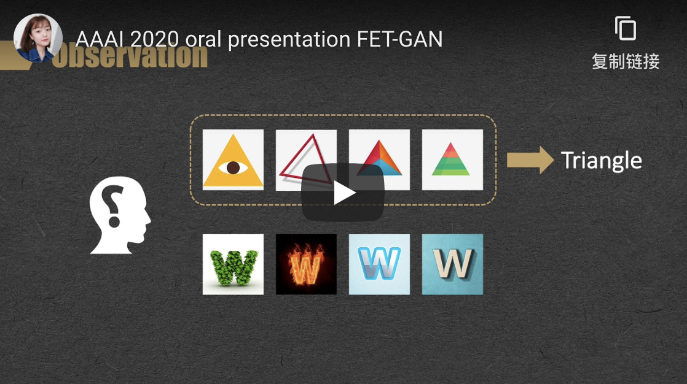
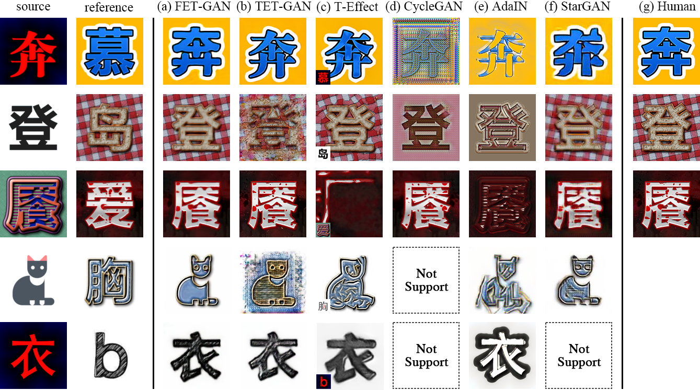
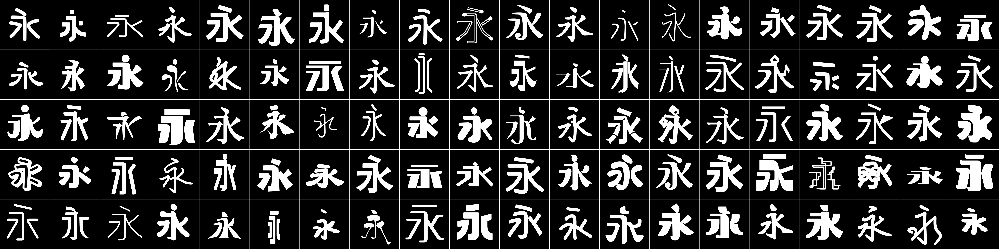

# FET-GAN

This is the webpage of the paper:

Li W, He Y, Qi Y, Li Z, Tang Y. FET-GAN: Font Effect Transfer via K-shot Adaptive Instance Normalization[C //Proceedings of the AAAI Conference on Artificial Intelligence. 2020, 34.

It is provided for educational/research purpose only. Please consider citing our paper if you find it useful for your work.

## Abstract

Text effect transfer aims at learning the mapping between text visual effects while maintaining the text content. 
While remarkably successful, existing methods have limited robustness in font transfer and weak generalization ability to unseen effects. 
To address these problems, we propose FET-GAN, a novel end-to-end framework to implement visual effects transfer with font variation among multiple text effects domains. 
Our model achieves remarkable results both on arbitrary effect transfer between texts and effect translation from text to graphic objects. 
By a few-shot fine-tuning strategy, FET-GAN can generalize the transfer of the pre-trained model to the new effect. 
Through extensive experimental validation and comparison, our model advances the state-of-the-art in the text effect transfer task. 
Besides, we have collected a font dataset including 100 fonts of more than 800 Chinese and English characters. 
Based on this dataset, we demonstrated the generalization ability of our model by the application that complements the font library automatically by few-shot samples. 
This application is significant in reducing the labor cost for the font designer. 

## Presentation Video (Youtube)

## Experimental Results

## Download

### Paper
[coming soon]

### Webpage
* 

### Code
* 

### Pre-trained models
* 
* 

### Datasets

* 
* 

## How to Use

### Installation

<!--## Citation-->

