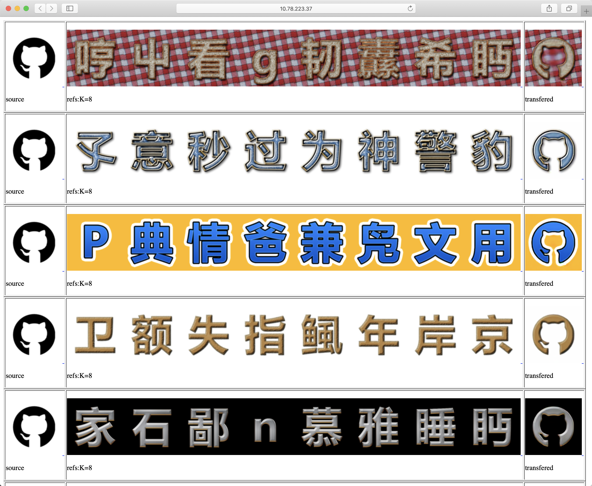
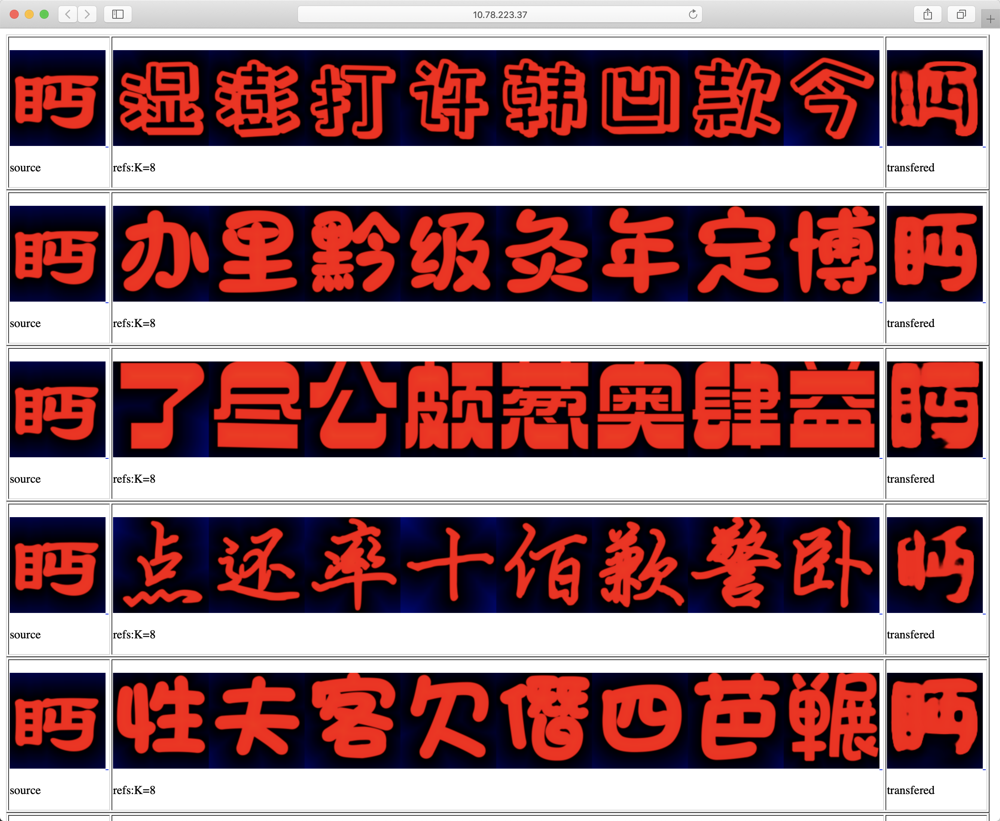
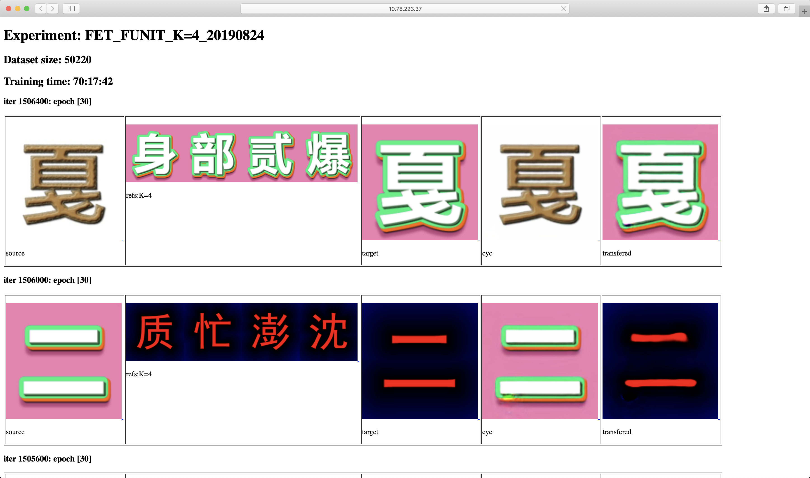

# FET-GAN

This is the webpage of the paper:

Li W, He Y, Qi Y, Li Z, Tang Y. FET-GAN: Font Effect Transfer via K-shot Adaptive Instance Normalization[C //Proceedings of the AAAI Conference on Artificial Intelligence. 2020, 34.

<p align="center"></p>

It is provided for educational/research purpose only. Please consider citing our paper if you find it useful for your work.

## Abstract

Text effect transfer aims at learning the mapping between text visual effects while maintaining the text content. 
While remarkably successful, existing methods have limited robustness in font transfer and weak generalization ability to unseen effects. 
To address these problems, we propose FET-GAN, a novel end-to-end framework to implement visual effects transfer with font variation among multiple text effects domains. 
Our model achieves remarkable results both on arbitrary effect transfer between texts and effect translation from text to graphic objects. 
By a few-shot fine-tuning strategy, FET-GAN can generalize the transfer of the pre-trained model to the new effect. 
Through extensive experimental validation and comparison, our model advances the state-of-the-art in the text effect transfer task. 
Besides, we have collected a font dataset including 100 fonts of more than 800 Chinese and English characters. 
Based on this dataset, we demonstrated the generalization ability of our model by the application that complements the font library automatically by few-shot samples. 
This application is significant in reducing the labor cost for the font designer. 

## Presentation Video (Youtube)

<p align="center"><a href="http://www.youtube.com/watch?v=txYmA5ePDOM"></a></p>

## Experimental Results


## Download

### Paper
[coming soon]

### Webpage
* <a href="https://liweileev.github.io/FET-GAN/"></a>

### Code
* <a href="https://github.com/liweileev/FET-GAN"></a>

### Pre-trained models
* <a href="https://drive.google.com/drive/folders/13kqa8miU97IMsIyM-KpBmr1kd8nHWUJy"></a>
* <a href="https://pan.baidu.com/s/1403BzONK60QSf0v2aoRNFg"></a>

### Datasets

We collect a new dataset called Fonts-100 which includes 100 fonts each with 775 Chinese characters, 52 English letters, and 10 Arabic numerals.
There are a total of 83,700 images, each of which is 320*320 in size.
The following figure shows an overview of these fonts for the same Chinese character.


This Fonts-100 dataset is used to demonstrate the ability of our model to assist the font designer in complementing characters in font library.
We take the first 80 fonts for training, and the remaining 20 as unseen for finetuning.
You can get this dataset here: 

* <a href="https://drive.google.com/open?id=1OcOSTg29IY9UDCEB2gL4d3ALpUyvzD-2"></a>
* <a href="https://pan.baidu.com/s/1xhKpuSqHWxLlll9Rwf_7cA"></a>

We also provided the texteffects dataset in the above drive links.
This dataset is proposed in [TET-GAN](https://github.com/williamyang1991/TET-GAN).
It is paired that each text effect image is provided with its font image.
We separate 6 fonts and combine them with the original 64 effects.
Finally, there are a total of 70 classes of text effects and divide them into train/finetune as the Fonts-100 dataset.

## How to Use

### Installation

* Clone this repo:

```bash
git clone https://github.com/liweileev/FET-GAN
cd FET-GAN/codes/
```

* Install dependencies

```
python -m pip install -r requirements.txt
```

* Download datasets from [Google Drive](https://drive.google.com/open?id=1OcOSTg29IY9UDCEB2gL4d3ALpUyvzD-2) / [Baide Drive](https://pan.baidu.com/s/1xhKpuSqHWxLlll9Rwf_7cA) and unzip them to datasets folder.
* Download pre-trained models from [Google Drive](https://drive.google.com/drive/folders/13kqa8miU97IMsIyM-KpBmr1kd8nHWUJy) / [Baide Drive](https://pan.baidu.com/s/1403BzONK60QSf0v2aoRNFg) and unzip them to outputs folder.

Then you get the directory & file structure like this:

```
codes
└───configs
└───data
└───datasets
│   └───Fonts100
│   │   └───finetune
│   │   └───train
│   └───TextEffects
│   │   └───finetune
│   │   └───train
└───finetune_imgs
└───models
└───networks
└───outputs
│   └───Fonts100
│   │   └───checkpoints
│   │   │   │   30_net_D.pth
│   │   │   │   30_net_E.pth
│   │   │   │   30_net_G.pth
│   │   │   opt.txt
│   └───TextEffects
│   │   └───checkpoints
│   │   │   │   30_net_D.pth
│   │   │   │   30_net_E.pth
│   │   │   │   30_net_G.pth
│   │   │   opt.txt
│   requirements.txt
│   test.py
└───testimgs
│   train.py
└───utils
```

### Quick Testing

* Test the model:

```
python test.py
```

The default test is for TextEffects dataset. You can change the setting in test.py

* View the results:

The test results will be saved to a html file here: ./testresults/TextEffects/TextEffects/test_latest/index.html.

The results for TextEffects dataset is like this:



The reulsts for Fonts100 dataset is like this:


* single image mode / images directory mode

You can switch the test mode by setting the opt['testsource']/opt['testsource_dir'] & opt['testrefs']/opt['testrefs_dir'] to None in test.py.
And then re-run script.

The number of reference images also can be changed by setting opt['K'] and the default is 8.

### Train

* Train the model:

```
python train.py
```

The default train is for TextEffects dataset. You can change opt['fonteffects_dir'] in train.py
All other settings are here: configs/font_effects.yaml

* view training results and loss plots

We use Visdom for visualization as default, and the defalut URL is http://localhost:8097. 

You can setting the display_id less than 1 if you don't want to use Visdom.

To see more intermediate results, check out ./outputs/[train name]/web/index.html. You can get the page like this:



The default training epoch is 30 and we save the nets every epoch here: ./outputs/[train name]/checkpoints/


<!--## Citation-->


